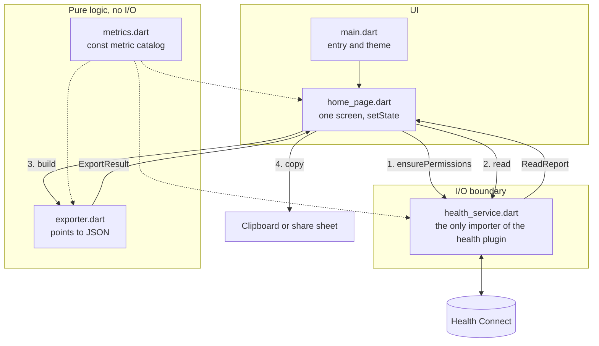

<p align="center"></p>

# Copy Fit

A personal Android app that pulls your health data out of **Health Connect** and
puts it on the clipboard as JSON, so you can paste it into ChatGPT for coaching.

Android only. Sideload only. Not built for the Play Store.

## What it does

1. Asks Health Connect for read access to the metrics you pick.
2. Reads back the range you choose (24 hours to 1 year).
3. Formats the result as JSON and copies it to the clipboard.

**The default range is the last 24 hours**, for a daily check-in: exported in
the morning it returns last night's sleep and nothing older, so each day's
paste to a coach adds only what is new.

That one range is **rolling** — it counts back 24 hours from the moment you
export. Every other range covers **whole calendar days** ending tonight, so "3
days" is midnight two days ago through the end of today. The difference matters
for cumulative metrics: a rolling window starts mid-day, so its first day's step
count is partial. The export says so in its `notes` and reports the window's
exact `from` and `to` rather than dates. Sleep is unaffected either way — a
session comes back whole or not at all.

**Sleep is the only metric selected by default.** Everything else — steps,
heart rate, workouts, body measurements, vitals, intake — is there but opt-in,
because a coaching conversation is usually about one thing at a time and every
extra metric costs tokens.

Nothing leaves the phone. There is no network code and no analytics — the only
way data moves is the clipboard or the share sheet, both of which you trigger.

## Formats

**Daily summary** (the default) — one object per calendar day, with each metric
rolled up. This is the one to paste into a chat: a month of data is typically a
few thousand tokens.

```json
{
  "export": {
    "source": "Android Health Connect",
    "generated_at": "2026-09-20T11:24:03-06:00",
    "range": { "start": "2026-08-22", "end": "2026-09-20" },
    "format": "daily_summary",
    "notes": ["..."]
  },
  "units": { "steps": "count", "distance": "m", "heart_rate": "bpm", "weight": "kg" },
  "days": [
    {
      "date": "2026-09-19",
      "steps": 8421,
      "distance": 6210,
      "active_energy": 512,
      "heart_rate": { "min": 48, "avg": 68.2, "max": 142, "n": 1440 },
      "resting_heart_rate": 52,
      "sleep": {
        "asleep_min": 465,
        "in_bed_min": 480,
        "efficiency_pct": 96.9,
        "session_count": 2,
        "main_sleep": {
          "start": "2026-09-18T23:00:00-06:00",
          "end": "2026-09-19T06:00:00-06:00",
          "in_bed_min": 420, "asleep_min": 420, "efficiency_pct": 100,
          "deep_min": 72, "rem_min": 98, "light_min": 250, "awake_min": 15
        },
        "naps": [
          { "start": "2026-09-19T14:00:00-06:00", "end": "2026-09-19T14:45:00-06:00",
            "in_bed_min": 45, "asleep_min": 45, "light_min": 45 }
        ]
      },
      "weight": 81.2,
      "workouts": [
        { "activity": "RUNNING", "energy_kcal": 410, "distance_m": 6800,
          "start": "2026-09-19T06:30:00-06:00", "duration_min": 42 }
      ]
    }
  ]
}
```

**Raw points** — every individual reading. Complete, but heart rate alone can be
hundreds of readings a day, so this runs to megabytes over long ranges. Use it
when you want a specific day analysed in detail.

The result card shows the byte size and a rough token count before you copy, so
you can tell whether it will fit in a chat.

### Conventions worth knowing

- Days are **local calendar days**, and a day with no data is left out entirely.
- **Sleep is filed under the date the session ended** (the wake-up date). Stages
  are attached to the session that contains them *first*, then the whole session
  is dated — so a night crossing midnight stays intact rather than scattering its
  pre-midnight stages onto the previous day.
- `main_sleep` is the longest session of the day. `naps` holds every other
  session, each keeping its own `start` and `end`.
- Day-level `asleep_min` / `in_bed_min` are **totals across all sessions**, so a
  night plus an afternoon nap add up. Per-session figures live inside each
  session object.
- Within a session, `asleep_min` is deep + REM + light and excludes awake;
  `in_bed_min` is the full session length; `efficiency_pct` is their ratio.
- `stages_available: false` means the source logged a session with no stage
  breakdown, so `asleep_min` falls back to the session length.
- `unassigned_stages` is stage time belonging to no session. It is excluded from
  `asleep_min` and is normally a source quirk — surfaced rather than dropped so
  the numbers stay honest.
- Every metric other than sleep is filed under the date its reading started.
- Units are listed per metric in the top-level `units` object rather than baked
  into key names, so they reflect what Health Connect actually returned.

## Running it

Needs Flutter and an Android SDK. `flutter doctor` should be clean.

```sh
flutter pub get
flutter test
```

One test checks that calendar windows start at midnight across a
daylight-saving change. On a machine whose timezone never changes its clocks it
passes trivially, so to exercise it for real:

```sh
TZ=America/Denver flutter test test/export_range_test.dart
```

Day to day, run it from VS Code: press F5 with the phone attached. The Dart
extension detects a Flutter project and launches in debug mode without needing
a launch configuration — `.vscode/` is deliberately untracked, so nothing is
checked in. Debug builds print the per-type read report to the Debug Console,
which is easier to read and copy than the on-screen Diagnostics card.

Hot reload does not re-read saved preferences, so after changing the default
metric set use hot **restart**.

From the terminal the equivalent is:

```sh
flutter run            # debug, with hot reload
flutter run --release  # release timings on the device
```

### Building a standalone APK

Only needed if you want the app on the phone without a cable:

```sh
flutter build apk --release --split-per-abi
adb install -r build/app/outputs/flutter-apk/app-arm64-v8a-release.apk
```

The app bar shows the running version, read from `pubspec.yaml` at runtime, so
you can tell which build is on the phone without checking `adb`.

The release build is signed with the local **debug** keystore, which is fine for
sideloading. The catch: if that keystore is ever regenerated, a new APK will not
install over the old one and you will have to uninstall first. If that becomes
annoying, create a real keystore and wire it into
`android/app/build.gradle.kts`.

## Where settings live

Range, format, the recording-app toggle and the metric selection are stored with
`shared_preferences`, which on Android is a private XML file in the app's own
data directory:

```
/data/data/com.davidwilliston.copy_fit/shared_prefs/FlutterSharedPreferences.xml
```

Every change is written immediately, so a choice survives closing the app
without running an export. The values survive app updates and reinstalls; they
are wiped by an uninstall or by "Clear storage" in app info. Clearing storage
also revokes the Health Connect permissions, so the app comes back at its
defaults and asks for access again.

The `metrics` key is versioned (`metrics.v2`). Bump it when the default
selection changes, otherwise a saved set from an older build masks the new
default.

## First run

Health Connect must be installed — it ships with Android 14+ and is a Play Store
app before that. The banner at the top of the screen says whether it is present
and offers to install it if not.

On the first read, Android shows the Health Connect permission screen. Grant the
metrics you care about. **Ranges longer than 30 days also need the "historical
data" permission**, which Health Connect asks for separately; without it your
export silently stops at 30 days. The app warns you about this when you pick a
long range.

If a metric comes back empty, the **Diagnostics** card under the result explains
why: it lists every Health Connect type separately with how many points it
returned, whether the permission was granted, the dates actually covered, and the
error if the read threw. In debug builds the same report prints to the console.

The most common cause of a short export is the **30-day cap**: without the
historical-data permission, Health Connect silently truncates every read to the
last 30 days. The Diagnostics card says outright whether that permission was
granted and flags a result that looks truncated.

## Architecture

Four layers, with dependencies pointing one way only. `exporter.dart` never
touches the plugin, `health_service.dart` never builds JSON, and `metrics.dart`
depends on nothing but the `HealthDataType` enum.



Solid arrows are calls and returns; dotted arrows show the metric catalog being
read as data. Nothing in **Pure logic** depends on anything above it, which is
what makes the exporter testable without a device.

| Path | What it is |
| --- | --- |
| `lib/metrics.dart` | The catalog of exportable metrics and how each aggregates |
| `lib/export_range.dart` | The selectable windows, rolling or calendar, and their query bounds |
| `lib/health_service.dart` | The only file that imports `health`: permissions, reads, diagnostics |
| `lib/exporter.dart` | Pure transformation of Health Connect points into the JSON document |
| `lib/home_page.dart` | The single-screen UI |
| `lib/main.dart` | App entry and theme |
| `test/exporter_test.dart` | Aggregation rules — the part worth testing |
| `test/export_range_test.dart` | Window bounds, including across a daylight-saving change |
| `test/widget_test.dart` | Boot, permission-warning states, settings persistence |

### The catalog is data

`kMetrics` is a `const` list binding a JSON key, a label, a group, a set of
Health Connect types and an `Agg` kind. The picker, the reads and the
aggregation all derive from that one list, so there is no metric-specific
branching anywhere else. The mapping is deliberately one-to-many: `sleep` owns
eight Health Connect types, while blood pressure is two metrics over one record.

**To add a metric**, add an entry to `kMetrics` *and* the matching
`android.permission.health.READ_*` line to
`android/app/src/main/AndroidManifest.xml`. Nothing enforces that pairing — a
metric without its permission fails silently at runtime, though the Diagnostics
card will show it as denied rather than leaving you guessing.

### The exporter is pure

`Exporter(points, metrics, start, end, format) -> ExportResult` does no I/O and
touches no widgets. That is the most consequential choice here: all the awkward
logic lives in one testable place, so midnight-crossing nights, nap separation
and orphan stages are covered without a device attached.

### Crossing the bridge

Flutter is Dart; Health Connect is an Android API. The `health` plugin bridges
them, with a Dart half your code calls and a Kotlin half that does the talking.
Messages pass between them over a channel, one request out and one reply back,
once per data type.

Only simple things fit through that channel: text, numbers and lists. Health
Connect hands the Kotlin half a rich object — a `SleepSessionRecord` with typed
timestamps and nested stages — which cannot travel as-is. So the Kotlin half
takes it apart:

```
SleepSessionRecord               {
  startTime : Instant     ──►      "date_from"   : 1758240000000,
  endTime   : Instant     ──►      "date_to"     : 1758268800000,
  metadata  : Metadata    ──►      "source_name" : "com.fitbit.FitbitMobile",
  stages    : List<Stage> ──►      "uuid"        : "a1b2c3..."
}                                }
```

Dates become milliseconds, everything else becomes text or numbers in a
labelled map, and the Dart half rebuilds that into a `HealthDataPoint`. It is
flat-pack furniture: you cannot post the assembled thing, so it ships as parts
and is reassembled at the far end.

### What the flattening costs

Some structure does not survive the trip:

- **Nesting is gone.** A sleep session's stages arrive as separate top-level
  points rather than nested inside their session, so `_buildSleep` has to put
  the night back together — though the uuid below makes that exact rather than
  a guess.
- **Blood pressure is split.** One `BloodPressureRecord` becomes two
  independent streams, systolic and diastolic, paired only by timestamp.
- **`sourceId` is always empty** and **`deviceModel` is always null** on
  Android; both are iOS-only fields.
- **Timestamps lose precision**, from nanoseconds to milliseconds. Irrelevant
  at the resolution anything here is measured in.

One thing does survive, and it matters: **every stage carries its parent
session's `uuid`**. The Kotlin half passes the session's metadata down to each
stage, so the parent-child link is preserved as what amounts to a foreign key
even though the nesting is not. `_buildSleep` matches on that uuid, falling
back to the stage's interval only when a stage arrives without its session —
which happens when the session began before the queried window.

### Two deliberate breaks in the pipeline

**Sleep bypasses per-point bucketing.** Every other metric files each point into
a day on its own. A sleep stage cannot be — it only means something relative to
its session. So sleep points are diverted into `_buildSleep`, which collects
sessions, attaches stages by time containment, and files each session under the
date it ended. It is the most intricate function in the app and the one to read
first when sleep output looks wrong.

**Reads return diagnostics, not just points.** Denied, unsupported, absent and
30-day-capped all produce zero points and are indistinguishable from outside.
So `read()` returns a `ReadReport`, where every type carries its own count,
permission state, dates covered, source and error, and `TypeDiagnostic.verdict`
renders that as a sentence.

### Deliberate omissions

No state-management package: one screen and one linear flow, so `setState` is
less code than the alternative. No caching layer either — every export re-reads
Health Connect, which is why a long multi-metric read takes several seconds.

### Launcher icon

The icon is an adaptive icon, which every supported device uses (minSdk 28).
The launcher masks it to its own shape — a circle on a Pixel — so the mark is
sized to sit inside the 66dp safe zone of the 108dp canvas, reaching about 27dp
from centre. Anything beyond that zone is clipped by some launchers, which is
easy to miss: a full-bleed preview can look fine while the masked icon on the
phone loses a corner.

| Resource | Role |
| --- | --- |
| `mipmap-anydpi-v26/ic_launcher.xml` | The adaptive icon: background plus foreground |
| `drawable/ic_launcher_background.xml` | The blue gradient, as a drawable so it is crisp at every density |
| `mipmap-*/ic_launcher_foreground.png` | The mark on transparency, at five densities |
| `mipmap-*/ic_launcher.png` | Fallback with the background baked in; unused on any supported device, since the adaptive icon takes precedence from API 26 |
